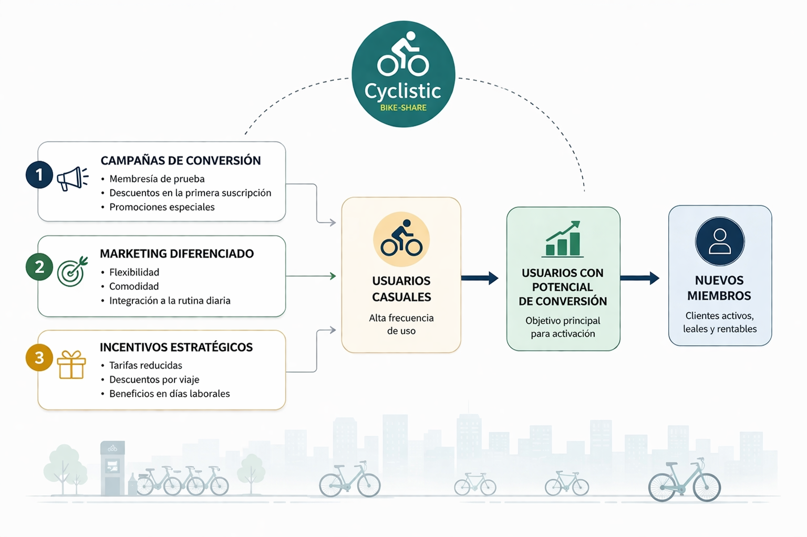

## **Introducción**

En este caso de estudio se seguirá la estructura clásica del análisis de datos:

* Preguntar
* Preparar
* Procesar
* Analizar
* Compartir 
* Actuar

De este modo, será posible abordar el problema de negocio planteado por Cyclistic.

## **1. Preguntar**

La primera pregunta que tenemos es la siguiente:

> *"¿Cómo usan de manera diferente las bicicletas Cyclistic los miembros anuales y los usuarios ocasionales?"*

Para esto primero debemos identificar el problema que se quiere resolver, y es
que se busca **maximizar la rentabilidad de la empresa** mediante una mayor conversión de usuarios casuales en miembros anuales. 

Para resolver este problema, debemos responder a la pregunta inicial usando el análisis 
de datos, pudiendo obtener **patrones que definan el comportamiento de cada grupo de usuarios**. Esto permitirá identificar qué dimensiones clave explican por qué los usuarios casuales se mantienen en esa categoría y no se convierten en miembros anuales. A su vez, permitirá identificar qué aspectos comparten la mayoría de los miembros anuales, e intentar incentivar esa característica en los actuales miembros casuales. 

Por lo tanto, el **Business Task** se podría definir como: 

> **A partir de los datos disponibles, identificar las principales diferencias entre usuarios casuales y miembros anuales, con el fin de generar recomendaciones para el equipo de marketing de Cyclistic que incentiven la conversión de usuarios casuales a membresías anuales.**

## **2. Preparar**

A continuación, se prepararán los datos para el análisis. En este caso, se deben considerar los conjuntos de datos **Divvy 2019 Q1** y **Divvy 2020 Q1** en formato csv, los cuales fueron descargados y alojados en el directorio "data" de la carpeta del caso. Estos datos serán reasignados como **data_2019** y **data_2020** respectivamente durante el desarrollo de este estudio.

```{r importar_datos, message=FALSE, warning=FALSE}
library(tidyverse)   # manipulación y transformación de datos
library(glue)        # interpolación de strings
library(lubridate)   # manejo de fechas
library(hms)         # manejo de tiempos (HH:MM:SS)
library(stringr)     # manipulación de strings
library(ggplot2)     # visualización de datos
library(dplyr)       # transformación de datos
library(leaflet)     # mapas interactivos
library(scales)      # formato de ejes y etiquetas
library(patchwork)   # composición de gráficos
library(kableExtra)  # Estética de tablas

data_2019 <- read.csv("data/Divvy_Trips_2019_Q1.csv")
data_2020 <- read.csv("data/Divvy_Trips_2020_Q1.csv")
```

Las variables que contiene cada dataset son las siguientes:

```{r columnas_2019, message=TRUE, warning=FALSE}
colnames(data_2019)

```
```{r columnas_2020, message=TRUE, warning=FALSE}
colnames(data_2020)
```
<span  style="color: grey;">
**Nota**: Como se observa, se tiene una discrepancia en los nombres de las columnas, por lo cual se debe tomar en cuenta esto ya que todos nuestros datos deben estar alineados en estructura y nomenclatura. 
</span>

Con esto nos podemos hacer una idea del tipo de información que tenemos, principalmente relacionada a los orígenes y destinos de los viajes registrados en los dos años de estudio, en conjunto con variables demográficas como edad y género. 

### **2.1 ¿Estos datos son ROCCC?**

Para saber si nuestros datos son ROCCC debemos considerar las siguientes características: 

- **Reliable (Confiable):** No son del todo confiables ya que aparentemente están incompletos al no ser complementarios entre si. ⚠️
- **Original (Original):** Sí son datos originales, ya que provienen de Motivate International Inc.✅
- **Comprehensive (Completo):** Los datos pueden ser incompletos, ya que se aprecia que son dos fuentes no del todo compatibles. ⚠️
- **Current (Actualizado):** Estan desactualizados, pero eso no disminuye en gran medida su valor para responder la pregunta del caso.✅
- **Cited (Citado):** Es una fuente ampliamente citada así que si cumple con este criterio.✅

Se observa que los datos no cumplen plenamente con todos los criterios ROCCC. Sin embargo, mediante un proceso de limpieza y homologación, aún es posible obtener información valiosa y pertinente para responder la pregunta de negocio.

### **2.2 ¿Los datos son Íntegros?**

Para verificar la integridad de los datos se definirán algunos criterios que serán evaluados más adelante: 

- **Completitud:** Que los datos presenten suficiente volumen para ser analizados.
- **Unicidad:** Valores de cierta naturaleza sin duplicados.
- **Consistencia / Validez:** Formatos de datos y rangos de valores que sean coherentes dado el contexto de los datos.
- **Alineación de esquemas**: Verificar la compatibilidad de las dos fuentes de datos que se usarán.  
<br>

#### **2.2.1 Completitud** 
Para verificar la completitud de los datos se procede a identificar el porcentaje de valores nulos de cada columna en ambos dataset, teniendo los siguientes resultados:

```{r completitud_datos, message=FALSE, warning=FALSE, echo=FALSE}
colnames_2019 <- colnames(data_2019)
colnames_2020 <- colnames(data_2020)

n_rows_2019 <- nrow(data_2019)
n_rows_2020 <- nrow(data_2020)

n_nulls_2019 <- c()
n_nulls_2020 <- c()

dtype_2019 <- c()
dtype_2020 <- c()

for (col in colnames_2019){
  n_nulls <- sum(is.null(data_2019[[col]]) | data_2019[[col]] %in% c("", " "))
  n_nulls_2019 <- c(n_nulls_2019, n_nulls)
  dtype_2019 <- c(dtype_2019, class(data_2019[[col]]))
}

for (col in colnames_2020){
  n_nulls <- sum(is.null(data_2020[[col]]) | data_2020[[col]] %in% c("", " "))
  n_nulls_2020 <- c(n_nulls_2020, n_nulls)
  dtype_2020 <- c(dtype_2020, class(data_2020[[col]]))
}

# DF de completitud para datos del 2019
df_comp_2019 <- data.frame("columna" = colnames_2019,
                           "tipo" = dtype_2019,
                            "nulos" = n_nulls_2019,
                            "pct_nulos" = round(n_nulls_2019/n_rows_2019*100, 3))

# DF de completitud para datos del 2020
df_comp_2020 <- data.frame("columna" = colnames_2020,
                           "tipo" = dtype_2020,
                            "nulos" = n_nulls_2020,
                            "pct_nulos" = round(n_nulls_2020/n_rows_2020*100, 3))

knitr::kable(
  df_comp_2019,
  digits = 2,
  caption = "Completitud de variables (Cyclistic, 2019)",
  align = "c"   
)

knitr::kable(
  df_comp_2020,
  digits = 2,
  caption = "Completitud de variables (Cyclistic, 2020)",
  align = "c"   
)
```

Se puede observar que en términos de completitud ambos dataset se mantienen en porcentajes bajísimos, siendo la variable "género" la más alta con un porcentaje del 5.4%. Por lo anterior este criterio se cumple en ambas fuentes.  
<br>


#### **2.2.2 Unicidad**
Para verificar la unicidad de las fuentes de datos basta con verificar que los campos cuya naturaleza debería ser identificar un registro único (*trip_id* y *ride_id*) no contengan valores duplicados. 

```{r unicidad_datos, message=FALSE, warning=FALSE}
dup_2019 <- data_2019 %>% 
  summarise(
  filas_duplicadas_2019 = sum(duplicated(trip_id))  
  )

dup_2020 <- data_2020 %>% 
  summarise(
  filas_duplicadas_2020 = sum(duplicated(ride_id))  
  )

duplicated_rows = data.frame(dup_2019, dup_2020)

```

```{r, echo=FALSE}
knitr::kable(
  duplicated_rows,
  digits = 1,
  caption = "IDs duplicados (Cyclistic, 2019 y 2020)",
  align = "c"   
)
```

<span  style="color: grey;">
**Nota**: Cabe mencionar que el formato de la llave primaria en el dataset 2019 es numérico, mientras que el del dataset del 2020 es una cadena hexadecimal, por lo que será un tema a tratar más adelante. 
</span>

Se observa que no existen IDs duplicados en las llaves primarias de ambos conjuntos de datos, por lo cual este criterio igualmente se encuentra aprobado.  

Es oportuno revisar igualmente si los IDs de las estaciones son consistentes entre ambos datasets. Identificando los nombres que no presentan coincidencias exactas entre ambos datasets tenemos lo siguiente: 

```{r ids_station_consistence, echo=FALSE, message=FALSE, warning=FALSE}

stations_2019 <- data_2019 %>%
  transmute(station_id = as.character(from_station_id),
            station_name_2019 = str_squish(from_station_name)) %>%
  filter(!is.na(station_id), station_id != "", !is.na(station_name_2019), station_name_2019 != "") %>%
  distinct()

stations_2020 <- data_2020 %>%
  transmute(station_id = as.character(start_station_id),
            station_name_2020 = str_squish(start_station_name)) %>%
  filter(!is.na(station_id), station_id != "", !is.na(station_name_2020), station_name_2020 != "") %>%
  distinct()

id_name_mismatch <- stations_2019 %>%
  inner_join(stations_2020, by = "station_id") %>%
  filter(station_name_2019 != station_name_2020) %>%
  arrange(station_id)

```


```{r show_station_names_mismatch, echo=FALSE, message=FALSE, warning=FALSE}

knitr::kable(
  id_name_mismatch,
  caption = "Discrepancias de Nombres de estaciones (2019-2020)",
  digits = 1,
  align = "c"
)

```

Se puede observar que estos casos evidentemente **SÍ** representan la misma estación, aún sin presentar coincidencia exacta, por lo cual en la alineación de esquemas se considerará el nombre de estación del dataset de 2020 y se comprueba que estos IDs sí presentan coherencia.  
<br>


#### **2.2.3 Consistencia y Validez**
Para verificar la consistencia de los datos debemos tomar en cuenta el tipo de datos de cada variable. En este caso, es posible identificar variables de tipo temporal, categórico y numérico, por lo que se deben considerar distintos criterios de validación para cada una de ellas.

<u>**Variables de Fechas:**</u>

El rango de fechas no debe excederse a valores incoherentes (muy antiguos o futuros). Además, si un campo marca el inicio del trayecto y otro el final, se debe cumplir que uno siempre presenta un horario estrictamente anterior a la otra.

Revisando las variables de tiempo en el dataset del 2019 tenemos lo siguiente

```{r consistencia_fechas_2019, echo=TRUE, message=TRUE, warning=FALSE}

date_vars_2019 <- c("start_time","end_time")
summary(data_2019[date_vars_2019])

```
Se observa que ambas variables de *start_time* y *end_time* están en formato de caracter, por lo que en el procesamiento de los datos **se debe cambiar el formato a fecha**. 

Ahora para el dataset del año 2020 tenemos lo siguiente: 

```{r consistencia_fechas_2020, echo=TRUE, message=TRUE, warning=FALSE}

date_vars_2020 <- c("started_at","ended_at")
summary(data_2020[date_vars_2020])

```
En este caso las únicas dos variables de fecha igualmente están en formato de caracter, por lo cual **se debe considerar cambiar a formato de fecha** para su análisis en la fase de procesamiento.

<u>**Variables Categóricas:**</u>

Si el campo es categórico, debe presentar única y exclusivamente las categorías que tengan sentido representar. Se debe tener especial cuidado con las redundancias (p.ej: "Male", "male", "m", etc) y con los campos categóricos que solo presentan una categoría, ya que estos no agregan ningun valor estadístico a los datos. 

Para el caso de los datos de los datos del 2019 tenemos lo siguiente: 

```{r consistencia_categ_2019, echo=FALSE}
categ_vars_2019 <- c("from_station_name", "to_station_name", "usertype", "gender")
categ_vars_consistence_2019 <- data_2019 %>% 
  summarise(
    distincts_from_station_name = n_distinct(from_station_name),
    distincts_to_station_name = n_distinct(to_station_name),
    distincts_usertype = n_distinct(usertype),
    distincts_gender = n_distinct(gender)
  )

```

```{r show_categ_vars_2019_table, echo=FALSE}
knitr::kable(
  categ_vars_consistence_2019,
  digits = 1,
  caption = "Categorías distintas (Cyclistic, 2019)",
  align = "c"   
)
```

Se observa una ligera discrepancia entre los nombres de las estaciones de origen y destino, pero para fines del análisis no tiene un impacto significativo. Por otro lado, se tiene que existen dos tipos de usuarios y tres géneros. Estos corresponden a las siguientes categorías:

```{r categories_data_2019, echo=FALSE}

categ_usertype <- data_2019 %>% 
  count(usertype)

categ_genre <- data_2019 %>% 
  count(gender)
```

```{r show_categ_usertype_table, echo=FALSE}

knitr::kable(
  categ_usertype,
  digits = 1,
  caption = "Categorías usertype (Cyclistic, 2019)",
  align = "c"   
)

```

Se observa que hay 2 tipos de clientes; Clientes (6.3%) y Subscriptores (93.7%), sin inconsistencias en las categorías.

```{r show_categ_genre_table, echo=FALSE}

knitr::kable(
  categ_genre,
  digits = 1,
  caption = "Categorías genre (Cyclistic, 2019)",
  align = "c"   
)

```


Por otro lado, en el género se tienen 3 categorías; Female (18.3%), Male (76.2%) y en blanco (5.5%), por lo que estos valores convendría **transformarlos a Nulos** para mejorar la facilidad y calidad del análisis. 

Para las categorías de los datos del 2020 tenemos lo siguiente: 

```{r consistencia_categ_2020, echo=FALSE}

categ_vars_consistence_2020 <- data_2020 %>% 
  summarise(
    distincts_rideable_type = n_distinct(rideable_type),
    distincts_start_station_name = n_distinct(start_station_name),
    distincts_end_station_name = n_distinct(end_station_name),
    distincts_member_casual = n_distinct(member_casual)
  )

```

```{r show_categ_vars_2020_table, echo=FALSE}
knitr::kable(
  categ_vars_consistence_2020,
  digits = 1,
  caption = "Categorías distintas (Cyclistic, 2020)",
  align = "c"   
)
```

Se observa que la variable *rideable_type* tiene solamente una categoría, por lo cual no aporta variabilidad ni poder explicativo en los datos, pudiendo ser descartada del análisis. En cuanto a las estaciones de origen y destino, se tiene de nuevo una leve discrepancia que se considera despreciable. En la variable *members_casual* de tienen 2 categorías, siendo las siguientes:

```{r categ_member_casual, echo=FALSE}

categ_member_casual <- data_2020 %>% 
  count(member_casual)

```

```{r show_categ_member_casual_table, echo=FALSE}
knitr::kable(
  categ_member_casual,
  digits = 1,
  caption = "Categorías de 'member_casual' (Cyclistic, 2020)",
  align = "c"   
)
```
<br>

En este caso se tiene la variable que diferencia a los usuarios casuales y a los que tienen una suscripción (members), por lo cual esta variable en conjunto con *usertype* serán fundamentales en el análisis posterior.


<u>**Variables numéricas:**</u>

Para las variables numéricas se debe tener en cuenta algunas cosas distintas. Por ejemplo, si la variable representa edad, distancia o alguna otra magnitud cuantificable, debe encontrarse dentro del rango coherente de valores que la describan. Es decir, que no existan edades negativas o superiores a X cantidad de tiempo, o que la distancia no sea excesivamente grande según el contexto que determina el problema.

Para este caso, las variables numéricas para el dataset del 2019 son las siguientes: 

```{r consistencia_num_2019, echo=FALSE}
numeric_vars_2019 <- c("tripduration", "birthyear")
summary(data_2019[numeric_vars_2019])

```
El campo de *tripduration* si bien deberia ser numérico (tiempo de viaje) está en formato de caracter, por lo cual se debe cambiar su formato a numérico, o bien calcularse más adelante como la diferencia entre los tiempos de inicio y fin de cada viaje. En cuanto a la variable *birthyear* se tiene que el rango de valores están relativamente coherente salvo por el límite inferior de 1900 el cual o bien podrian ser valores atípicos o es alguna regla de completado de datos (en caso de no tener o no saber se marca el 1900) por lo que conviene revisar gráficamente la distribución de la variable.


```{r birthyear_graph, echo=FALSE, warning=FALSE, message=FALSE}

birthyear_dist <- ggplot(data_2019, aes(x = birthyear)) +
  geom_histogram(
    color = "#0d4f8b",
    fill = "#1f77b4",
    alpha = 0.3,
    linewidth = 0.3
  ) +
  scale_x_continuous(breaks = seq(1900, 2010, by = 20)) +
  scale_y_continuous(
    labels = scales::label_number(scale = 1e-3, suffix = "k")
  ) +
  labs(
    title = "Distribución de variable 'birthyear'",
    x = "Año de nacimiento",
    y = "Frecuencia",
    caption = "Fuente: Cyclistic (2019). Elaboración propia"
  ) +
  theme_bw() +
  theme(
    plot.title = element_text(face = "bold"),
    panel.grid.major.x = element_blank(),
    panel.grid.minor.x = element_blank(),
    panel.grid.minor.y = element_blank(),
    panel.grid.major.y = element_line(color = "gray80")
  )

show(birthyear_dist)
```
<br>
Se puede observar que la distribución es coherente para la naturaleza de la variable, ya que los valores en el limite inferior son claramente valores atípicos (outliers). 

En cuanto a las variable numéricas del dataset de 2020 tenemos lo siguiente: 

```{r consistencia_num_2020, echo=FALSE}

numeric_vars_2020 <- c("start_lat", "start_lng", "end_lat", "end_lng")
summary(data_2020[numeric_vars_2020])

```
Estas coordenadas decimales se encuentran proyectadas en WGS84 y calzan perfectamente con Chicago, tal como se aprecia en el siguiente mapa.

```{r map_trips_cyclist_2020, echo=FALSE}
pal <- colorFactor(
  palette = c("red", "blue"),
  domain = c("Inicio", "Fin")
)
data_2020 %>%
  filter(!is.na(start_lat), !is.na(start_lng),
         !is.na(end_lat), !is.na(end_lng)) %>%
  sample_n(min(6000, n())) %>%  
  leaflet() %>%
  addProviderTiles(providers$CartoDB.Positron) %>%
  addCircleMarkers(~start_lng, ~start_lat, radius = 2, stroke = FALSE, fillOpacity = 0.3, color = "red") %>%  addCircleMarkers(~end_lng, ~end_lat, radius = 2, stroke = FALSE, fillOpacity = 0.3, color = "blue") %>%  addLegend(position = "bottomright",
            pal = pal,
            values = c("Inicio", "Fin"),
            title = "Puntos",
            opacity = 1) %>%
  addControl(html = "<b>Puntos de inicio/fin de viajes (muestra)</b>", position = "topright")
```

#### **2.2.4 Alineación de esquemas**

Considerando que se está analizando dos dataset de dos años consecutivos, se debe definir una estrategia de homologación. Es por esto que la alineación de esquemas permitirá unificar los datos disponibles en un solo dataset que permitirá facilitar el procesamiento posterior y la obtención de información y conclusiones a partir del análisis de este nuevo dataset integrado.

Considerando que ya se estudió la naturaleza de las variables de ambos datasets, se debe realizar un mapeo que relacione ambos datasets de una forma coherente, con un único nombre de columna asignado a cada característica, tal como se presenta a continuación: 

```{r, echo=FALSE}
knitr::kable(
  matrix(c(
    "trip_id","ride_id","Sí","numeric/character","Se deben consolidar ambos tipos de datos",
    "start_time","started_at","Sí","datetime"," -- ",
    "end_time","ended_at","Sí","datetime"," -- ",
    "bike_id","N/A","No","numeric","No presente en datos del 2020",
    "tripduration","N/A","No","numeric","Se puede calcular",
    "from_station_id","start_station_id","Sí","character","Revisar consistencia",
    "from_station_name","start_station_name","Sí","character","Revisar consistencia",
    "to_station_id","end_station_id","Sí","character","Revisar consistencia",
    "to_station_name","end_station_name","Sí","character","Revisar consistencia",
    "usertype","member_casual","Sí","character","Variable clave del análisis",
    "gender","N/A","No","character","No presente en datos del 2020",
    "birthyear","N/A","No","character","No presente en datos del 2020",
    "N/A","start_lat/lng y end_lat/lng","No","coordenada","No presente en datos del 2019"
  ), ncol = 5, byrow = TRUE),
  col.names = c("Columna 2019","Columna 2020","Tiene Equivalencia","Tipo","Observación"),
  caption = "Mapeo de variables entre datos del 2019 y 2020"
) %>%
  kable_styling(full_width = FALSE, bootstrap_options = c("striped", "bordered"))

```

Gran parte de las variables tiene equivalencia entre ambos datasets, sin embargo las variables de *bike_id*, *tripduration*, *gender*, *birthyear* y coordenadas no tienen una directa relación, por lo cual, en la consolidación de los datos, se considerará mantener estas variables permitiendo valores nulos en los registros del dataset complementario, así no se pierde información que eventualmente podría ayudar al análisis del problema. 


## **3. Procesar**

Una vez familiarizado con los datos, y sabiendo los principales conflictos que presenta, se continuará con el procesamiento de los datos, para así poder realizar un análisis con la mejor calidad de datos que sea posible. 

Para esto se usará principalmente el lenguaje **R** en conjunto con la librería **tidyverse**, la cual permite utilizar un amplio set de herramientas para limpieza y procesamiento de datos, permitiendo además aplicar estos procesos de forma explícita, facilitando la documentación de cada transformación en los datos. 

Los pasos que se realizarán durante el procesamiento serán los siguientes:

1. **Formateo de fechas**
2. **Nulos en variable Género**
3. **Eliminar campo sin variabilidad**
4. **Campos de duración de viaje**
5. **Día de la semana de inicio de viaje** 
6. **Validación de IDs**
7. **Filtrado de registros inválidos**
8. **Alineación de esquemas** 

### **3.1 Formateo de fechas**

Considerando que las variables de fechas de ambos datasets están en formato character, se procede a cambiarlo a formato de fecha-hora:

```{r format_date, echo=TRUE, message=TRUE, warning=FALSE}

data_2019_proc <- data_2019 %>% 
  mutate(start_time = ymd_hms(start_time),
         end_time = ymd_hms(end_time)
         )

data_2020_proc <- data_2020 %>% 
  mutate(started_at = ymd_hms(started_at),
         ended_at = ymd_hms(ended_at)
         )

```


```{r date_verification, echo=FALSE, message=FALSE, warning=FALSE}

campos <- c("start_time (2019)",
            "end_time (2019)",
            "started_at (2020)",
            "ended_at (2020)")
tipos <- c(class(data_2019_proc$start_time)[1],
             class(data_2019_proc$end_time)[1],
             class(data_2020_proc$started_at)[1],
             class(data_2020_proc$ended_at)[1])

date_verification_df <- data.frame(campos, tipos) 

knitr::kable(
  date_verification_df,
  digits = 1 ,
  caption = "Verificación de tipo de datos",
  align = "c"
)

```

Se puede apreciar que el tipo de datos en los campos modificados quedó en *POSIXct* la cual resulta ser el formato de fecha nativa más precisa de R.

### **3.2 Nulos en Género**

En este campo del *dataset_2019* hay valores en blanco que deberían considerarse como *Nulos*, por lo que se deben reemplazar sus valores: 

```{r replace_blanks_values, echo=TRUE, message=FALSE, warning=FALSE}

data_2019_proc <- data_2019_proc %>% 
  mutate(
    gender = str_trim(gender),
    gender = na_if(gender, ""),
    gender = na_if(gender, " "),
    )

```

Ahora verificando los resultados, se tiene que el campo *gender* no tiene valores en blanco, sino nulos. 

```{r verification_null_gender, echo=FALSE, message=FALSE, warning=FALSE}

data_2019_proc %>% 
  count(gender)

```

### **3.3 Eliminar campo sin variabilidad**

En el *dataset_2020* se tiene la variable *rideable_type* la cual solo contiene un único valor, por lo cual será eliminada del dataset: 

```{r delete_rideable_type_variable, echo=TRUE, message=FALSE, warning=FALSE}

data_2020_proc <- data_2020_proc %>% 
  select(-rideable_type)

```

Verificando las columnas existentes en el dataset, no se encuentra *rideable_type*.

```{r verification_delete_rideable_variable, echo=FALSE, message=TRUE, warning=FALSE}

colnames(data_2020_proc)

```
### **3.4 Campos de duración de viaje**

En este caso lo que se debe hacer es formatear el campo *tripduration* (*dataset_2019*) al formato *HH:MM:SS* y calcularlo igualmente para el *dataset_2020* como una variable nueva.

Se comienza formateando el campo tripduration existente: 

```{r tripduration_format, echo=TRUE, message=FALSE, warning=FALSE}

data_2019_proc <- data_2019_proc %>% 
  mutate(
    tripduration = str_replace(tripduration, ",", ""),
    tripduration = as.numeric(tripduration),
    tripduration = hms::as_hms(tripduration)
    )

```

con esto ahora el campo *tripduration* se ve de esta forma: 

```{r tripduration_sample, echo=FALSE, message=TRUE, warning=FALSE}

td_data_sample <- head(data_2019_proc$tripduration, 5)
tripduration_sample <- data.frame(tripduration = td_data_sample)
knitr::kable(
  tripduration_sample,
  caption = "Formato de tripduration (data_2019)",
  digits = 1,
  align = "c"
)

```

Ahora se calcula para el dataset del año 2020:

```{r ride_length_calculate, echo=TRUE, message=FALSE, warning=FALSE}

data_2020_proc <- data_2020_proc %>% 
  mutate(ride_length = hms::as_hms(ended_at - started_at))

```


Quedando el campo igualmente de la siguiente manera: 

```{r ride_length_sample, echo=FALSE, message=TRUE, warning=FALSE}

rl_data_sample <- head(data_2020_proc$ride_length, 5)
ride_length_sample <- data.frame(ride_length = rl_data_sample)
knitr::kable(
  ride_length_sample,
  caption = "Formato de ride_length (data_2020)",
  digits = 1,
  align = "c"
)

```


### **3.5 Día de inicio de viaje**

Se calcula el día de la semana en que inició cada viaje en ambos datasets, considerando 1 como Lunes y 7 como Domingo.

```{r day_of_week_2019, echo=TRUE, message=FALSE, warning=FALSE}

data_2019_proc <- data_2019_proc %>% 
  mutate(day_of_week = wday(start_time, week_start = 1))

data_2020_proc <- data_2020_proc %>% 
  mutate(day_of_week = wday(started_at, week_start = 1))

```

Quedando el campo *day_of_week* de la siguiente manera en ambos datasets:

```{r verification_day_of_week, echo=FALSE, message=FALSE, warning=FALSE}

dow_sample <- data_2019_proc %>% 
  slice_sample(n = 10) %>% 
  select(start_time,day_of_week)
knitr::kable(
  dow_sample,
  caption = "Día de la semana (2019)",
  digits = 1,
  align = "c"
)

```

### **3.6  Validación de IDs**

Tal como se observó antes, la llave primaria del dataset 2019 es numérica, mientras que en el del dataset del 2020 es hexadecimal, por lo cual ambos campos de ID se mantendrán como *character* y al momento de la unificación de esquemas pasarán a coexistir en un único campo (*ride_id*), diferenciado por una columna adicional llamada *source* el cual diferenciará el año del que proviene cada dato.

### **3.7  Filtrado de registros inválidos**

Para asegurar la coherencia de los datos, se procederá a revisar los registros que tengan *start_time* posterior a *end_time* en 2019 y *started_at* posterior al *ended_at* para el dataset del 2020: 

```{r date_diff_filter_show, echo=FALSE, message=FALSE, warning=FALSE}

nrow_delete_2019 <- data_2019_proc %>% 
  filter(start_time > end_time) %>% 
  nrow()

nrow_delete_2020 <- data_2020_proc %>% 
  filter(started_at > ended_at) %>% 
  nrow()

df_filter <- data.frame(dataset = c("2019", "2020"), registros_invalidos = c(nrow_delete_2019, nrow_delete_2020))

knitr::kable(
  df_filter,
  caption = "Inconsistencias entre tiempos de viajes (2019-2020)",
  digits = 1,
  align = "c"
)

```
Con esto se puede observar que el dataset del 2020 presenta 117 inconsistencias que deben ser corregidas y descartadas del dataset para evitar análisis erróneos: 

```{r date_diff_filter, echo=TRUE, message=FALSE, warning=FALSE}

data_2020_proc <- data_2020_proc %>% 
  filter(started_at <= ended_at)

```

Si bien algunas variables presentan valores atípicos y colas largas, la consistencia general del dataset es suficiente para avanzar con un análisis confiable. La eventual exclusión de ciertos rangos extremos se evaluará en la etapa de análisis, de acuerdo con el objetivo del estudio y el impacto en la interpretación de resultados.

### **3.8  Alineación de esquemas**

Ahora conviene alinear ambos datasets en un único DataFrame unificado que contenga toda la información. Para eso, se considerará el campo **source** como la flag que diferenciará desde que fuente de datos viene cada registro al momento de la unión, y se implementará el siguiente mapeo de columnas: 

```{r schemma_alignment_table, echo=FALSE, message=FALSE, warning=FALSE}

campo_2019 <- c("trip_id",
                "start_time",
                "end_time",
                "bikeid",
                "tripduration",
                "from_station_id",
                "from_station_name",
                "to_station_id",
                "to_station_name",
                "usertype",
                "gender",
                "birthyear",
                "day_of_week",
                "N/A",
                "N/A",
                "N/A",
                "N/A") 

campo_2020 <- c("ride_id",
                "started_at",
                "ended_at",
                "N/A",
                "ride_length",
                "start_station_id",
                "start_station_name",
                "end_station_id",
                "end_station_name",
                "member_casual",
                "N/A",
                "N/A",
                "day_of_week",
                "start_lat",
                "start_lng",
                "end_lat",
                "end_lng")

match_flag <- c("Sí",
                "Sí",
                "Sí",
                "No",
                "Sí",
                "Sí",
                "Sí",
                "Sí",
                "Sí",
                "Sí",
                "No",
                "No",
                "Sí",
                "No",
                "No",
                "No",
                "No")

campo_unif <- c("ride_id",
                "started_at",
                "ended_at",
                "bike_id",
                "ride_length",
                "start_station_id",
                "start_station_name",
                "end_station_id",
                "end_station_name",
                "usertype",
                "gender",
                "birthyear",
                "day_of_week",
                "start_lat",
                "start_long",
                "end_lat",
                "end_long"
                )

df_schemma_alignment <- data.frame(columna_2019 = campo_2019,
                                   columna_2020 = campo_2020,
                                   coincide = match_flag,
                                   nombre_final = campo_unif)

knitr::kable(
  df_schemma_alignment,
  caption = "Alineamiento de esquemas (2019-2020)",
  digits = 1,
  align = "c"
)

```

Cabe mencionar que los campos que no tengan **coincidencia** directa entre datasets, tendrán valores Nulos en el dataset complementario. Es decir, por ejemplo, que el campo *birthyear* y *gender* del dataset 2019 tendrán valores nulos en los registros provenientes del dataset 2020, el cual no tiene valores para estas variables. 

Además el campo *usertype* del dataset 2019 tiene los valores de *"Subscriber"* y *"Customer"* los cuales deberán reemplazarse por *"member"* y *"casual"* para que la columna sea coherente con las categorías del dataset 2020.

Alineando los esquemas se tiene lo siguiente: 

```{r schemma_alignment, echo=TRUE, message=FALSE, warning=FALSE}

data_2019_aligned <- data_2019_proc %>% 
  rename(
    ride_id = trip_id,
    started_at = start_time,
    ended_at = end_time ,
    bike_id = bikeid ,
    ride_length = tripduration,
    start_station_id = from_station_id,
    start_station_name = from_station_name,
    end_station_id = to_station_id,
    end_station_name = to_station_name
  ) %>% 
  mutate(source = "2019",
         ride_id = as.character(ride_id),
         usertype = recode(usertype,
                           "Subscriber" = "member",
                           "Customer" = "casual")
  )

data_2020_aligned <- data_2020_proc %>% 
  rename(
    usertype = member_casual
  ) %>% 
  mutate(source = "2020")

rides_consolidated <- bind_rows(data_2019_aligned,
                                data_2020_aligned)


```

Con esto, se dispone de un dataset consolidado y listo para iniciar la etapa de análisis.


## **4. Analizar**

Para este proceso se llevará a cabo un análisis descriptivo que permitirá conocer el comportamiento de las variables y las posibles relaciones que existan entre ellas. 

### **4.1 Variable "ride_length"**

La distribución de los tiempos de viaje, considerando viajes inferiores a 2 horas (un límite de tiempo de viaje relativamente coherente), quedan de la siguiente manera: 

```{r ride_length_graph, message=FALSE, echo=FALSE, warning=FALSE}

ride_length_dist <- rides_consolidated %>%
  filter(ride_length <= 7200) %>%
  ggplot(aes(x = ride_length)) +
  geom_histogram(color = "#0d4f8b", fill = "#1f77b4", alpha = 0.3, linewidth = 0.4) +
  labs(
    title = "Distribución de Duración de viaje ('ride_length')",
    x = "Duración de viaje",
    y = "Frecuencia",
    caption = "Fuente: Cyclistic. Elaboración propia"
  ) +
  theme_bw() +
  theme(
    plot.title = element_text(face = "bold")
  )

show(ride_length_dist)

```

Pero al obtener las métricas globales de la variable sin filtros se obtienen los siguientes valores: 

```{r ride_length_summary, message=TRUE, echo=FALSE, warning=FALSE}

summary(rides_consolidated$ride_length)

```
Debido a la distribución fuertemente sesgada, conviene considerar los valores de los cuartiles y la mediana, en donde se observa que **globalmente el 50% de los viajes dura menos de 9 minutos**. 

### **4.2 Tiempos de viaje**

Separando este análisis por tipo de usuario, tanto casuales como miembros de Cyclistic, se tiene lo siguiente:

```{r ride_length_usertype_graph, message=FALSE, echo=FALSE, warning=FALSE }

ride_length_dist_by_user <- rides_consolidated %>%
  filter(ride_length <= 7200, usertype %in% c("casual", "member")) %>%
  mutate(usertype = factor(usertype, levels = c("member", "casual"))) %>%
  ggplot(aes(x = ride_length, fill = usertype, color = usertype)) +
  geom_histogram(position = "identity", bins = 20, alpha = 0.5, linewidth = 0.3) +
  scale_fill_manual(name = "Tipo de usuario",values = c("member" = "#1f77b4", "casual" = "#ff7f0e")) +
  scale_color_manual(name = "Tipo de usuario", values = c("member" = "#0d4f8b", "casual" = "#c45e00")) +
  scale_y_continuous(labels = scales::label_number(scale = 1e-3, suffix = "k")) +
  labs(
    title = "Distribución de duración de viaje por tipo de usuario",
    x = "Duración de viaje (HH:MM:SS)",
    y = "Frecuencia",
    fill = "Tipo de usuario",
    color = "Tipo de usuario",
    caption = "Fuente: Cyclistic. Elaboración propia"
  ) +
  theme_bw() +
  theme(
    plot.title = element_text(face = "bold"),
    panel.grid.major = element_line(color = "gray80"),
    panel.grid.minor = element_line(color = "gray90")
  )

ride_length_dist_by_user

```

Se observa que la cantidad de viajes realizados por usuarios casuales es considerablemente menor a la cantidad de viajes de usuarios que son miembros. Además, en ambos casos parece existir una concentración de registros por debajo de los 40 minutos. Observando las métricas tenemos lo siguiente:

```{r ride_length_casual_summary, message=FALSE, echo=FALSE, warning=FALSE}

summary(rides_consolidated$ride_length[rides_consolidated$usertype == "casual"])

```
```{r ride_length_member_summary, message=FALSE, echo=FALSE, warning=FALSE}

summary(rides_consolidated$ride_length[rides_consolidated$usertype == "member"])

```

Comparando ambos resultados tenemos que **el 50% de los viajes que son de usuarios casuales duran menos de 22 minutos**, mientras que **la mitad de los viajes de los miembros duran menos de 8 minutos (-63% respecto a los casuales)**, lo cual nos dice que los miembros suelen viajar durante trayectos más cortos que los usuarios casuales.

### **4.3 Tiempo de viaje diario**

Al analizar el tiempo de viaje por día de la semana para ambos grupos de usuarios se tiene lo siguiente: 

```{r ride_length_median_by_week_graph, echo=FALSE, message=FALSE, warning=FALSE}

mediana_por_dia <- rides_consolidated %>%
  filter(usertype %in% c("casual", "member")) %>%
  mutate(
    day_of_week = factor(
      day_of_week,
      levels = 1:7,
      labels = c("Lun", "Mar", "Mié", "Jue", "Vie", "Sáb", "Dom")
    )
  ) %>%
  group_by(day_of_week, usertype) %>%
  summarise(mediana_ride = median(ride_length, na.rm = TRUE), .groups = "drop")

ggplot(mediana_por_dia, aes(x = day_of_week, y = mediana_ride, fill = usertype, color = usertype)) +
  geom_col(position = "dodge", alpha = 0.5, linewidth = 0.4) +
  scale_fill_manual(
    name = "Tipo de usuario",
    values = c("member" = "#1f77b4", "casual" = "#ff7f0e")
  ) +
  scale_color_manual(
    name = "Tipo de usuario",
    values = c("member" = "#0d4f8b", "casual" = "#c45e00")
  ) +
  labs(
    title = "Mediana de duración por día y tipo de usuario",
    x = "Día de la semana",
    y = "Mediana de duración",
    fill = "Tipo de usuario",
    color = "Tipo de usuario",
    caption = "Fuente: Cyclistic. Elaboración propia"
  ) +
  theme_bw() +
  theme(
    plot.title = element_text(face = "bold"),
    panel.grid.major = element_line(color = "gray80"),
    panel.grid.minor = element_line(color = "gray90")
  )

```

Acá se puede observar que **los usuarios casuales tienen una tendencia a realizar viajes más largos durante toda la semana, aumentando el fin de semana**, mientras que **los miembros suelen hacer viajes en torno a los 8 minutos durante toda la semana**.  

### **4.4 Cantidad de viajes**

Contando la cantidad de viajes por día de la semana para los mismos dos tipos de usuarios se tiene lo siguiente:

```{r ride_count_by_week_graph, echo=FALSE, message=FALSE, warning=FALSE}

rides_consolidated %>%
  filter(usertype %in% c("casual", "member")) %>%
  mutate(
    day_of_week = factor(
      day_of_week,
      levels = 1:7,
      labels = c("Lun", "Mar", "Mié", "Jue", "Vie", "Sáb", "Dom")
    )
  ) %>%
  group_by(day_of_week, usertype) %>%
  summarise(n_rides = n(), .groups = "drop") %>%
  ggplot(aes(x = day_of_week, y = n_rides, fill = usertype, color = usertype)) +
  geom_col(position = "dodge", alpha = 0.5, linewidth = 0.4) +
  scale_fill_manual(name = "Tipo de usuario", values = c("member" = "#1f77b4", "casual" = "#ff7f0e")) +
  scale_color_manual(name = "Tipo de usuario", values = c("member" = "#0d4f8b", "casual" = "#c45e00")) +
  scale_y_continuous(labels = scales::label_number(scale = 1e-3, suffix = "k")) +
  labs(
    title = "Número de viajes por día y tipo de usuario",
    x = "Día de la semana",
    y = "Número de viajes",
    fill = "Tipo de usuario",
    color = "Tipo de usuario",
    caption = "Fuente: Cyclistic. Elaboración propia"
  ) +
  theme_bw() +
  theme(
    plot.title = element_text(face = "bold"),
    panel.grid.major = element_line(color = "gray80"),
    panel.grid.minor = element_line(color = "gray90")
  )

```

Se observa que **los miembros realizan más viajes durante los día de semana**, mientras que **los usuarios casuales aumentan ligeramente su cantidad de viajes los fines de semana**. Este patrón es consistente con un uso funcional del servicio, posiblemente asociado a desplazamientos cotidianos como viajes hacia y desde el trabajo. Esto se puede corroborar revisando el horario de los viajes a continuación.

### **4.5 Horario de viajes**

Ahora obteniendo la distribución horaria del comienzo de los viajes para ambos perfiles de usuarios se tiene lo siguiente:


```{r started_at_by_week_graph, echo=FALSE, message=FALSE, warning=FALSE}

rides_consolidated %>%
  filter(usertype %in% c("casual", "member"), !is.na(started_at)) %>%
  mutate(
    start_hour = hour(started_at),
    usertype = factor(usertype, levels = c("member", "casual"))
  ) %>%
  ggplot(aes(x = start_hour, fill = usertype, color = usertype)) +
  geom_histogram(binwidth = 1, position = "identity", alpha = 0.5, linewidth = 0.4) +
  scale_x_continuous(breaks = 0:23) +
  scale_y_continuous(
    labels = scales::label_number(scale = 1e-3, suffix = "k")
  ) +
  scale_fill_manual(
    name = "Tipo de usuario",
    values = c("member" = "#1f77b4", "casual" = "#ff7f0e")
  ) +
  scale_color_manual(
    name = "Tipo de usuario",
    values = c("member" = "#0d4f8b", "casual" = "#c45e00")
  ) +
  labs(
    title = "Distribución horaria de inicio de viajes",
    x = "Hora del día",
    y = "Número de viajes",
    fill = "Tipo de usuario",
    color = "Tipo de usuario",
    caption = "Fuente: Cyclistic. Elaboración propia"
  ) +
  theme_bw() +
  theme(
    plot.title = element_text(face = "bold"),
    panel.grid.major = element_blank(),
    panel.grid.minor = element_blank(),
    panel.grid.major.y = element_line(color = "gray80")
  )
```

Se observa que los miembros de Cyclistic concentran sus viajes principalmente durante la mañana (alrededor de las 7:00) y la tarde (cerca de las 17:00), patrón que es consistente con un uso asociado a desplazamientos laborales o rutinarios. En cambio, los usuarios casuales presentan una distribución más centrada en torno a las 15:00, lo que sugiere un uso distinto, posiblemente más recreativo o menos vinculado a horarios de trabajo.

### **4.6 Género v/s membresía**

Analizando la proporción de hombres y mujeres para ambos tipos de usuario se tiene los siguiente:

```{r gender_by_usertype_graph, echo=FALSE, message=FALSE, warning=FALSE}

gender_dist <- rides_consolidated %>%
  filter(
    usertype %in% c("member", "casual"),
    gender %in% c("Male", "Female")
  ) %>%
  group_by(usertype, gender) %>%
  summarise(n = n(), .groups = "drop") %>%
  group_by(usertype) %>%
  mutate(
    prop = n / sum(n),
    label = percent(prop, accuracy = 0.1)
  )

gender_member <- gender_dist %>%
  filter(usertype == "member") %>%
  ggplot(aes(x = "", y = prop, fill = gender)) +
  geom_col(width = 1, color = "white") +
  geom_text(
    aes(label = label),
    position = position_stack(vjust = 0.5),
    color = "white",
    fontface = "bold",
    size = 4
  ) +
  coord_polar(theta = "y") +
  scale_fill_manual(
    name = "Género",
    values = c("Male" = "#1f77b4", "Female" = "#ff7f0e"),
    labels = c("Male" = "Hombre", "Female" = "Mujer")
  ) +
  labs(
    title = "Usuarios miembros",
    fill = "Género",
    caption = "Fuente: Cyclistic. Elaboración propia"
  ) +
  theme_void() +
  theme(
    plot.title = element_text(face = "bold", hjust = 0.5), legend.position = "none"
  )

gender_casual <- gender_dist %>%
  filter(usertype == "casual") %>%
  ggplot(aes(x = "", y = prop, fill = gender)) +
  geom_col(width = 1, color = "white") +
  geom_text(
    aes(label = label),
    position = position_stack(vjust = 0.5),
    color = "white",
    fontface = "bold",
    size = 4
  ) +
  coord_polar(theta = "y") +
  scale_fill_manual(
    name = "Género",
    values = c("Male" = "#1f77b4", "Female" = "#ff7f0e"),
    labels = c("Male" = "Hombre", "Female" = "Mujer")
  ) +
  labs(
    title = "Usuarios casuales",
    fill = "Género"
  ) +
  theme_void() +
  theme(
    plot.title = element_text(face = "bold", hjust = 0.5)
  )

gender_member + gender_casual

```

<span  style="color: grey;">
**Nota:** El análisis por género se realiza únicamente con registros del dataset 2019, ya que esta variable no está disponible en los datos de 2020.
</span>

Se puede observar que los usuarios que son miembros presentan una proporción más alta de hombres que los usuarios casuales (+11.6%) lo cual podría sugerir que:

* Podrían existir diferencias en preferencias, patrones de uso o percepción de seguridad según género.
* Los hombres tienden a usar más bicicleta para ir a sus trabajos.
* Las mujeres prefieren usar bicicleta para fines recreativos o fuera de horario laboral.
* Las mujeres no se sienten seguras yendo en bicicleta al trabajo.

Estas diferencias podrían responder a múltiples causas; lo relevante es tratarlas como hipótesis a validar.

### **4.7 Resumen de conclusiones**

En general, los datos permiten identificar un perfil de uso claramente diferenciado entre los usuarios miembros y casuales de Cyclistic.

**Usuarios miembros de Cyclistic**

* Concentraron la mayor parte del volumen de viajes analizados, con aproximadamente un 91% del total.
* La duración mediana de sus viajes se mantuvo relativamente estable durante toda la semana, en torno a los 8 minutos.
* La mayor cantidad de viajes se registró entre lunes y viernes, reduciéndose de forma importante durante los fines de semana.
* Su distribución horaria presentó dos picos notorios, alrededor de las 7:00 a. m. y las 5:00 p. m.
* Mostraron una mayor proporción de viajes realizados por hombres, con un 80.8%.
* En conjunto, estos patrones sugieren un uso principalmente funcional y asociado a desplazamientos cotidianos, como viajes hacia y desde el trabajo.

**Usuarios casuales de Cyclistic**

* Representaron una porción mucho menor del total de viajes, con aproximadamente un 9%.
* La duración mediana diaria de sus viajes fue considerablemente mayor, ubicándose entre 15 y 25 minutos.
* Registraron menos viajes durante la semana y un aumento relativo en los fines de semana.
* Su distribución horaria fue más concentrada en horas de la tarde, con un punto alto en torno a las 3:00 p. m., sin los picos marcados observados en los usuarios miembros.
* Presentaron una mayor participación relativa de mujeres (31.6%) en comparación con los miembros.
* En conjunto, estos patrones sugieren un uso más vinculado a fines recreativos, ocasionales o no laborales.

Los usuarios miembros parecen utilizar Cyclistic principalmente como un medio de transporte cotidiano, mientras que los usuarios casuales presentan un comportamiento más asociado a ocio o uso esporádico. Esta diferencia es clave para orientar estrategias que incentiven la conversión de usuarios casuales a membresías anuales.


## **5. Propuestas para Cyclistic**

### **5.1 Diagnóstico general**

Los usuarios miembros y casuales usan Cyclistic de forma distinta: los miembros muestran un uso funcional y recurrente, mientras que los casuales presentan un comportamiento más recreativo y esporádico. Por eso, la estrategia debería enfocarse en convertir usuarios casuales en miembros anuales, destacando el valor de la membresía para usuarios frecuentes o potencialmente recurrentes.

### **5.2 Propuestas**


<span style="color: grey;">
*Fuente: Elaboración propia*
</span>

**1. Diseñar campañas de conversión dirigidas a usuarios casuales 📢️**

Los resultados muestran que los usuarios casuales realizan viajes más largos y concentran una parte importante de su uso en horarios de tarde y fines de semana, lo que sugiere una relación más recreativa u ocasional con el servicio. En este contexto, Cyclistic debería implementar campañas orientadas a transformar ese uso esporádico en una relación más frecuente y estable.

Para ello, podrían ofrecerse **membresías de prueba**, **descuentos en la primera suscripción anual** o **promociones** específicas para usuarios casuales que ya hayan realizado varios viajes en un mismo mes. El objetivo de esta estrategia sería demostrar que la membresía no solo resulta útil para trayectos laborales, sino también para usuarios que comienzan usando la bicicleta de forma ocasional y que podrían **integrarla gradualmente a sus desplazamientos habituales**.

**2. Desarrollar estrategias de marketing diferenciadas según el patrón de uso 🎯️**

El análisis evidencia que los usuarios miembro presentan un comportamiento asociado a la movilidad diaria, con picos claros en horarios de entrada y salida laboral, mientras que los usuarios casuales responden a una lógica de uso distinta. Por ello, Cyclistic no debería comunicar el servicio de la misma manera a ambos grupos.

En el caso de los miembros, la propuesta de valor puede centrarse en rapidez, practicidad y ahorro de tiempo en trayectos cotidianos. En cambio, para los usuarios casuales, la comunicación debería enfatizar **flexibilidad**, **comodidad** y **conveniencia**, mostrando cómo el servicio puede pasar de ser una alternativa recreativa a una opción útil para desplazamientos recurrentes. Esta diferenciación permitiría construir mensajes más efectivos y aumentar la probabilidad de conversión.

**3. Implementar incentivos en franjas horarias y días estratégicos 🎁**

Dado que los usuarios miembros concentran sus viajes en días hábiles y en horarios bien definidos, Cyclistic podría utilizar promociones estratégicas para incentivar a los usuarios casuales a probar el servicio en contextos más rutinarios.

Por ejemplo, podrían ofrecerse **tarifas reducidas**, **descuentos por viaje** o **beneficios temporales durante horarios de mañana en días laborales**, con el objetivo de acercar a estos usuarios a una experiencia de uso más similar a la de un miembro anual. Esta estrategia no solo permitiría aumentar la frecuencia de uso, sino también evaluar si una parte de los usuarios casuales puede ser persuadida de incorporar Cyclistic en sus desplazamientos cotidianos.

En conjunto, estas recomendaciones buscan transformar el uso ocasional de los usuarios casuales en hábitos de uso más frecuentes, aumentando así la probabilidad de conversión hacia membresías anuales y fortaleciendo el crecimiento sostenido de Cyclistic.